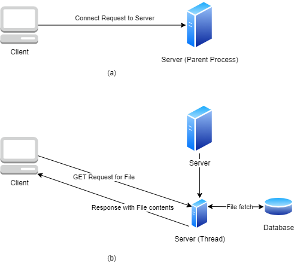

# Concurrent Web Server

This lab exercise aims to introduce students to basic client-server programming using sockets in Python. The students are provided with starter code that implements an "echo" client-server program and must modify it to create a concurrent web server that can handle multiple client requests. The article also provides background information on HTTP (Hypertext Transfer Protocol), which is used for communications on the World-Wide Web, and explains how an HTTP server must be able to handle multiple client requests simultaneously. The students are required to modify the server code to parse an incoming GET message, identify the requested file, and send its contents to the client. They must also handle multiple clients simultaneously using threads. The article provides instructions on how to run the client and server files and how to submit the modified code.

## Background

### HTTP (HyperText Transfer Protocol) (RFC1945)
HTTP has been in use by the World-Wide Web global information initiative since 1990. On the Internet, HTTP communications generally take place over TCP/IP connections. The default port is TCP 80, but other ports can be used.
 
There are two basic operations in HTTP: request and respond. A request message from a client to a server includes, within the first line of that message, the method to be applied to the resource (GET, HEAD, or POST. See RFC1945 for details), the identifier of the resource, and the protocol version in use. After receiving and interpreting a request message, a server responds in the form of an HTTP response message. A traditional HTTP GET request will request a file from a server using the format listed below:
 
> GET \<file path> HTTP/1.0\<CR>\<LF>\<CR>\<LF>
 
This command will be sent to the server as simple text (bytes). You may assume the control command for <CR> and <LF> (Carriage Return and Line Feed) are \r and \n respectively. As an example, consider that the client sends the following string to the server. 
 
> GET file.txt HTTP/1.0\r\n\r\n

This implies that the client wishes to get the file <server current directory>/file.txt from the server using the HTTP  protocol.

### Concurrent Web Server
An HTTP server must also be able to handle multiple client requests, i.e., more than one client can connect to the server and be served simultaneously. The server must retain the same ability to interpret GET commands and appropriately respond with the requested file.

In order to accomplish this, the server must be able to spawn a new thread to service a new client request. The new thread is responsible for receiving and processing the client request and responding appropriately. 

Note that in order to service multiple clients that may send a request anytime, the server should not exit/close. (Hint: Infinite loops?)

Fig 1. Concurrent Server Working. (a) Client sends a “connect” request to the server. (b) The server launches a new thread to service the client. It receives the GET request, fetches the file from the database and responds with the file contents. 

## Usage

> python client.py [server hostname] [server port] [client port]\
> python server.py [server port]

The server should be executed first in a separate terminal. While it is running each client should be launched in a separate terminal with the server hostname and the port. 

#### Note:
1. The server hostname is generally “localhost” if the server and client are running on the same machine. 
2. The server port and client port should be different if they are launched on the same machine otherwise it can lead to bind errors.
3. While Web servers traditionally run on port 80, you need to use a non-reserved port (1024 or higher) for both the client and server in this exercise.