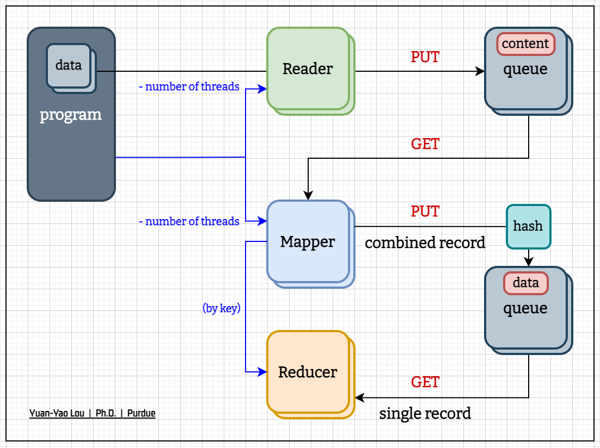

# Final Project - Map Reduce

* **Deadline**: 12/09 (Friday)
* **Language**: C/C++
* **Implementation**: Serial, OpenMP, MPI, Hybrid

<br />

## Milestone
``` text
┌── [O]  Nov 07: Initialization
├── [O]  Nov 11: Project setup / Serial version
├── [O]  Nov 12: Deliver
├── [O]  Nov 18: (dev)
├── [O]  Nov 25: (dev)
├── [O]  Dec 02: Review / Report
└── [O]  Dec 09: Submission
```

## Directory Structure
``` python
project
├── doc
│   ├── Architecture.pdf
│   └── Slides.pdf
│
├── fig
│   ├── Algorithms.png
│   ├── Architecture.png
│   └── Folder.png
│
├── data
│   ├── renew
│   ├── files.zip -> ../main/files.zip
│   ├── 1.txt       # ──┐
│   ├── (...)       # ──┤ Input files
│   └── 16.txt      # ──┘
│
├── main            # Codebase <----------------------------\   (only updated to SERIAL ver) 
│   ├── data -> ../data                                 #   |
│   ├── bin                                             #   |   (binary executable files)
│   │   ├── serial.o                                    #   |
│   │   ├── openmp.o                                    #   |
│   │   └── mpi.o                                       #   |
│   │                                                   #   |
│   ├── src                                             #   |   (algorithms part)
│   │   ├── algo.cpp                                    #   |   CORE cpp files
│   │   ├── serial.cpp                                  #   |
│   │   ├── openmp.cpp                                  #   |
│   │   ├── mpi.cpp                                     #   |
│   │   └── utility.cpp                                 #   |
│   │                                                   #   |
│   ├── include                                         #   |   (header files)
│   │   ├── algo.hpp                                    #   |
│   │   └── utility.hpp                                 #   |
│   │                                                   #   |
│   ├── makefile                                        #   |   compile, run
│   ├── main.cpp                                        #   |
│   │                                                   #   |
│   ├── serial.o -> ./bin/serial.o                      #   |
│   ├── openmp.o -> ./bin/openmp.o                      #   |
│   ├── mpi.o    -> ./bin/mpi.o                         #   |
│   │                                                   #   |
│   ├── README.md                                       #   |
│   ├── REL                                             #   |   rsync with "main" folder
│   ├── result.log                                      #   |   wordCount results
│   └── files.zip                                       #   |   input files archived
│                                                       #   |
├── user-Mike       # Source code / Result -----------------/   (SYNC through rsync cmd)
│
└── README.md
```

## Algorithms


## Evaluation
``` text
[TIMING]
1. 
2. 
3. 

[SPEEDUP (#FILES=15)]
1. Serial
2. OpenMP: 1, 2, 4, 8 (threads)
3. MPI: 1, 2, 4, 8 (nodes) with 3 threads (each core)
4. Hybrid: (OpenMP + MPI)

[PERFORMANCE]
1. Karp-Flatt Analysis
```