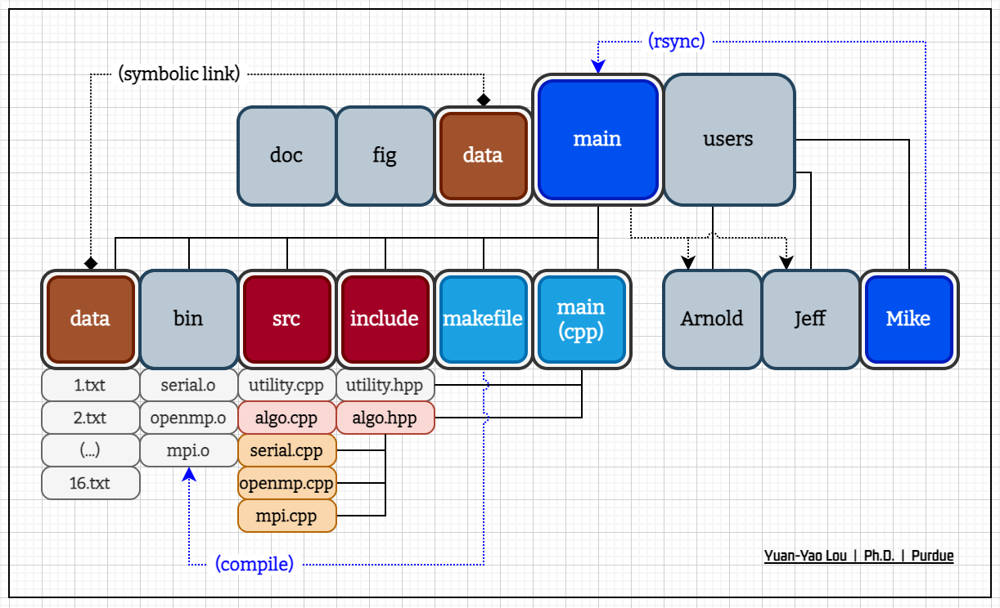
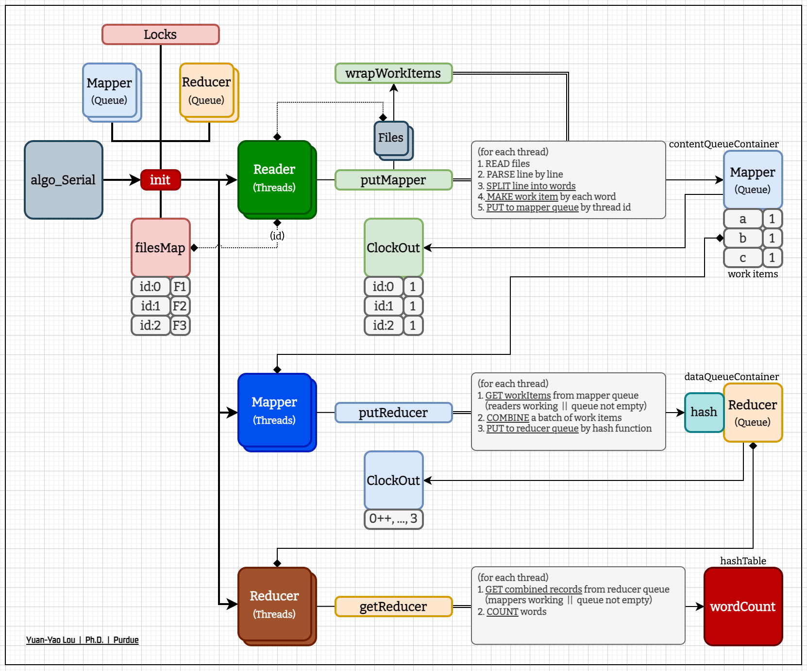

## System


## Directory Structure

``` python
user-Mike
│
├── data -> ../data
├── bin
│   └── serial.o
│
├── src
│   ├── algo.cpp
│   ├── serial.cpp
│   ├── openmp.cpp
│   ├── mpi.cpp
│   └── utility.cpp
│
├── include
│   ├── algo.hpp
│   └── utility.hpp
│
├── makefile                        # compile, run
├── main.cpp
│
├── serial.o -> ./bin/serial.o
│
├── README.md
├── result.log                      # wordCount results
└── files.zip                       # input files
```

## Algorithms

